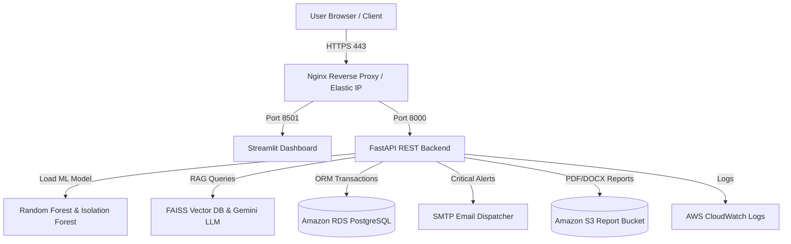

# AWS Cloud Deployment & Infrastructure Guide

This guide details the steps required to deploy the **Machine Learning + GenAI Powered Energy Prediction and Optimization System** on Amazon Web Services (AWS).

---

## 🏗️ Architecture Overview



---

## 🚀 Step-by-Step Deployment Guide

### 1. Provision Amazon RDS (PostgreSQL)
1. Go to AWS RDS Console -> **Create Database**.
2. Select **PostgreSQL 15+**, DB Instance Class `db.t3.micro` (Free Tier).
3. Set Master Username (`postgres`) and Master Password.
4. Enable **Publicly Accessible** or attach to VPC Security Group allowing port `5432` from EC2 instance.
5. Record Endpoint URL (e.g. `energy-db.cxxxx.us-east-1.rds.amazonaws.com`).

### 2. Launch AWS EC2 Instance
1. Go to EC2 Console -> **Launch Instance**.
2. Name: `Campus-Energy-Production`.
3. AMI: **Ubuntu Server 22.04 LTS**.
4. Instance Type: `t3.medium` (2 vCPU, 4GB RAM recommended for PyTorch/LangChain).
5. Configure Security Group Rules:
   - SSH (Port 22) - Restricted to your IP
   - HTTP (Port 80) - Custom / Any (`0.0.0.0/0`)
   - HTTPS (Port 443) - Any (`0.0.0.0/0`)
   - FastAPI (Port 8000) - Internal / Local
   - Streamlit (Port 8501) - Internal / Local
6. Associate an **Elastic IP** address to the EC2 instance for static IP mapping.

### 3. Configure IAM Role & CloudWatch
1. Attach IAM Role with `AmazonS3FullAccess` and `CloudWatchLogsFullAccess` to the EC2 instance.
2. Create S3 Bucket: `campus-energy-reports`.

### 4. Clone Repository & Run Provisioning Script
SSH into your EC2 instance:
```bash
ssh -i your-key.pem ubuntu@<YOUR_EC2_ELASTIC_IP>
```

Clone the repository and run setup:
```bash
git clone https://github.com/your-username/Energy-Prediction-Optimization-System.git
cd Energy-Prediction-Optimization-System

# Create .env from template
cp .env.example .env
nano .env  # Update DB_HOST, DB_PASSWORD, GOOGLE_API_KEY, SMTP details

# Execute automated deployment script
chmod +x deployment/setup_ec2.sh
./deployment/setup_ec2.sh
```

### 5. Configure SSL Certificate (Let's Encrypt HTTPS)
```bash
sudo certbot --nginx -d campusenergy.ai -d www.campusenergy.ai
```

---

## 📊 Verification & Health Checks
- **Streamlit Dashboard**: `https://campusenergy.ai`
- **FastAPI OpenAPI Documentation**: `https://campusenergy.ai/api/docs`
- **System Health**: `https://campusenergy.ai/api/health`
